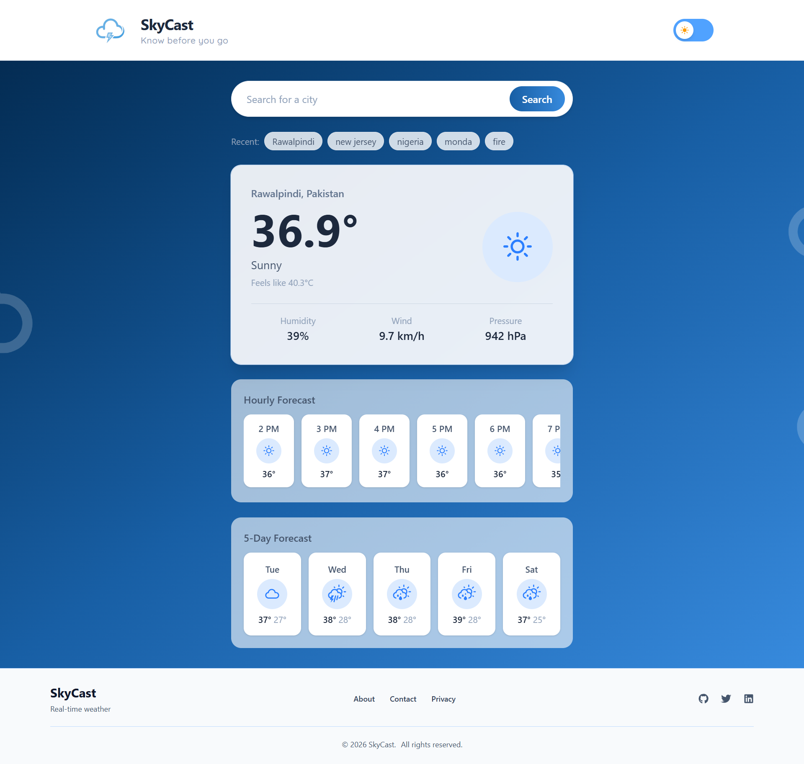
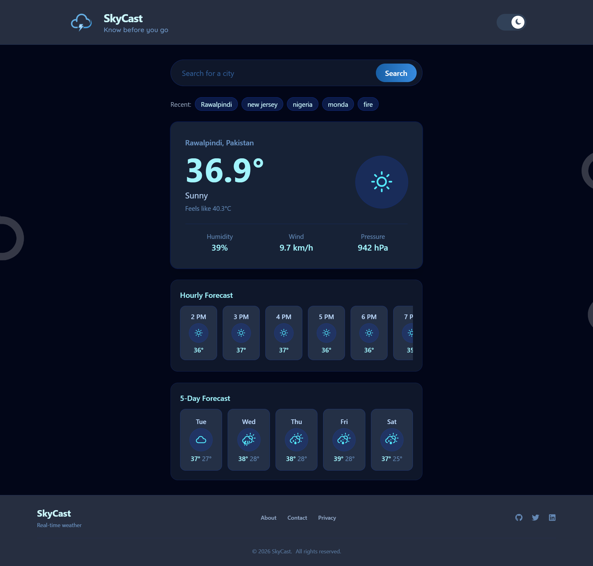

# 🌤️ SkyCast — Know Before You Go

A modern, responsive weather dashboard built with React. Search any city to see current conditions, an hourly forecast, and a 5-day outlook — with dark mode, recent searches, and a bit of visual flair.

🔗 **Live Demo:** [skycast-bay.vercel.app](https://skycast-bay.vercel.app/)
📦 **Repository:** [github.com/nahy1061/skycast](https://github.com/nahy1061/skycast)

---

## Screenshots

<!-- Add your screenshots below -->

### Light Mode



### Dark Mode



---

## Features

- **City Search** — search any city by name, with friendly error handling for invalid names and empty input
- **Current Weather** — temperature, feels-like, humidity, wind speed, and pressure
- **Hourly Forecast** — next 12 hours starting from the current time, with per-hour temperature, weather icon, and accurate day/night icon switching
- **5-Day Forecast** — daily high/low temperatures with weather icons
- **Recent Searches** — last 5 searched cities saved via Local Storage, no duplicates, click to reload
- **Dark / Light Mode** — theme toggle with a sliding switch, persisted across sessions
- **Animated Background** — floating cloud animation across the page
- **Loading & Error States** — spinner while fetching, clear error messages on failure
- **Fully Responsive** — optimized layouts for mobile, tablet, and desktop

---

## Tech Stack

- **React 19** (with Hooks & Context API)
- **Vite** — build tool and dev server
- **Tailwind CSS 4** — utility-first styling
- **react-icons** — weather icon set (`react-icons/wi`) and social icons (`react-icons/fa`)
- **Open-Meteo API** — weather data (no API key required)
- **Local Storage** — persisting recent searches and theme preference
- **Vercel** — deployment

---

## 🌐 API

This project uses the free [Open-Meteo API](https://open-meteo.com/), which requires no authentication.

Two endpoints are used together:

1. **Geocoding API** — converts a city name into coordinates
   `https://geocoding-api.open-meteo.com/v1/search?name={city}`

2. **Forecast API** — fetches current, hourly, and daily weather using those coordinates
   `https://api.open-meteo.com/v1/forecast?latitude={lat}&longitude={lon}&current=...&hourly=...&daily=...&timezone=auto`

The `hourly` block returns a full week's worth of hourly data; the app calculates the current hour's index and slices out the next 12 hours for display.

---

## 📁 Folder Structure

```text
src/
│
├── assets/
│   └── logo/                  # SkyCast logo
│
├── components/
│   ├── Header.jsx
│   ├── Footer.jsx
│   ├── SearchBar.jsx
│   ├── WeatherCard.jsx
│   ├── ForecastCard.jsx
│   ├── FiveDayForecast.jsx
│   ├── HourlyCard.jsx
│   ├── HourlyForecast.jsx
│   ├── RecentSearches.jsx
│   ├── Loading.jsx
│   ├── ErrorMessage.jsx
│   ├── ThemeToggle.jsx
│   ├── ThemeContext.jsx
│   └── CloudAnimation.jsx
│
├── pages/
│   └── Home.jsx
│
├── services/
│   └── weatherApi.js           # Open-Meteo API integration
│
├── utils/
│   ├── weatherCodes.js         # WMO weather code → icon/description mapping
│   ├── formatDate.js           # Date/time formatting + current-hour index helpers
│   └── recentSearches.js       # Local Storage helpers
│
├── index.css
├── theme.css
├── App.jsx
└── main.jsx
```

---

## 🚀 Installation

1. **Clone the repository**

   ```bash
   git clone https://github.com/nahy1061/skycast.git
   cd skycast
   ```

2. **Install dependencies**

   ```bash
   npm install
   ```

3. **Run the development server**

   ```bash
   npm run dev
   ```

   The app will be available at `http://localhost:5173`

4. **Build for production**
   ```bash
   npm run build
   ```

---

## Notes

- No API key or environment variables are required — Open-Meteo is free and open.
- Recent searches and theme preference are stored in the browser's Local Storage, so they persist across page refreshes but are specific to each browser/device.

---

## Acknowledgments

- Weather data provided by [Open-Meteo](https://open-meteo.com/)
- Icons from [react-icons](https://react-icons.github.io/react-icons/)
